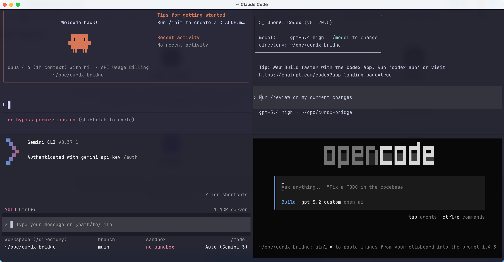
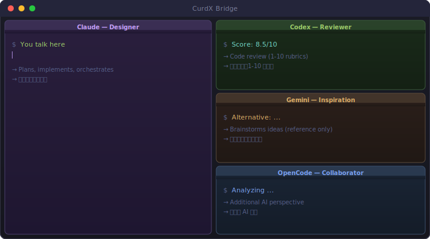

<div align="center">

# CurdX Bridge

**Multi-AI Split-Pane Terminal — Claude · Codex · Gemini · OpenCode**

One terminal, four AI agents, real collaboration.

[](LICENSE)
[](https://golang.org/)
[]()

**English** | [中文](README_zh.md)

</div>

---

<div align="center">

<br/>
<em>Claude, Codex, Gemini, and OpenCode working side by side in one terminal</em>
</div>

---

## What is this?

CurdX Bridge puts multiple AI coding agents into split terminal panes. You talk to Claude as usual — when you need a second opinion, just say "let Codex review this" or "ask Gemini for ideas". Claude handles the coordination automatically.

<div align="center">

</div>

No switching tabs. No copy-pasting context. Just talk.

## Quick Start

### 1. Install

```bash
curl -fsSL https://raw.githubusercontent.com/curdx/curdx-bridge/main/install.sh | bash
```

### 2. Run

```bash
curdx                                  # Default: Claude + Codex + Gemini
curdx claude codex gemini opencode     # All four providers
curdx claude codex                     # Just two providers
curdx -r                               # Resume previous session
curdx -r claude codex gemini           # Resume with specific providers
```

That's it. Panes appear, providers boot up, you start talking to Claude.

### Flags

| Flag | What it does |
|------|-------------|
| `-r` | Resume last session (keeps context) |
| `--no-auto` | Disable auto-approve mode |

## How It Actually Works

You don't need to learn new commands. Just talk to Claude naturally:

```
You:    Help me refactor this auth module.
Claude: [writes the refactored code]

You:    Let Codex review this.
Claude: [sends diff to Codex, waits for scores]
        Codex scored it 8.5/10. Suggestions: ...

You:    Ask Gemini for alternative naming ideas.
Claude: [asks Gemini asynchronously]
        Gemini suggests: ...

You:    Looks good. Apply Codex's suggestions and commit.
Claude: [makes changes, commits]
```

**That's the whole workflow.** Claude is your main interface. Codex, Gemini, and OpenCode are collaborators it can call on.

### Behind the scenes

When you say "let Codex review this", Claude uses built-in skills (`/ask`, `/pend`) to:
1. Send your request to the Codex pane via async protocol
2. Wait for Codex to finish (you can see it working in its pane)
3. Bring the result back into your conversation

Each provider runs in its own pane — you can watch them think in real time.

## Roles

| Role | Provider | What it does |
|------|----------|-------------|
| **Designer** | Claude | Plans, implements, orchestrates |
| **Reviewer** | Codex | Scores code/plans (1-10 rubrics) |
| **Inspiration** | Gemini | Brainstorms alternatives (reference only) |
| **Collaborator** | OpenCode | Additional AI perspective |

The review framework has pass/fail gates — code must score ≥ 7 before shipping. Up to 3 review rounds, then escalates to you.

## Commands (for power users)

You rarely need these — Claude handles them — but they exist:

```bash
# Direct communication
cask "message"    # Send to Codex
gask "message"    # Send to Gemini
oask "message"    # Send to OpenCode
lask "message"    # Send to Claude

# Check latest replies
cpend / gpend / opend / lpend

# Test connectivity
cping / gping / oping / lping

# Session management
curdx kill              # Kill all sessions
curdx kill codex -f     # Force kill specific provider
```

## Prerequisites

| You need | Install with |
|----------|-------------|
| **tmux** (or WezTerm) | `brew install tmux` / `apt install tmux` |
| **Claude Code** | `npm install -g @anthropic-ai/claude-code` |
| **Codex CLI** (optional) | `npm install -g @openai/codex` |
| **Gemini CLI** (optional) | See provider docs |
| **OpenCode CLI** (optional) | See provider docs |

Make sure each provider CLI works standalone first.

## Platforms

macOS (Intel/Apple Silicon) · Linux (x86-64/ARM64) · Windows (x86-64 + WSL)

## Configuration

### curdx.config

Place in `.curdx/curdx.config` (project-level) or `~/.curdx/curdx.config` (global):

```
claude codex gemini opencode
```

Or JSON for advanced options:

```json
{
  "providers": ["claude", "codex", "gemini", "opencode"],
  "flags": { "resume": true, "auto": true }
}
```

### Environment Variables

| Variable | What it does |
|----------|-------------|
| `CURDX_DEBUG=1` | Debug logging |
| `CURDX_LANG=zh` | Force Chinese |
| `CURDX_THEME=dark` | Force dark theme |

## Build from Source

```bash
git clone https://github.com/curdx/curdx-bridge.git
cd curdx-bridge
./scripts/build-all.sh
```

## Troubleshooting

| Problem | Fix |
|---------|-----|
| `curdx: command not found` | Add `~/.local/bin` to `$PATH` |
| No panes appear | Install tmux: `brew install tmux` |
| Provider unreachable | Run it standalone first (e.g. `codex`) |
| `Another instance running` | `curdx kill` then retry |

Debug mode: `CURDX_DEBUG=1 curdx`

## Changelog

See [Releases](https://github.com/curdx/curdx-bridge/releases) for release history.

## License

MIT. See [LICENSE](LICENSE).
